N/S 高等学校通学プログラミングコースでプログラミングメンターをしている [io](https://github.com/iorn121) です。
[筑波 NS ミライラボ Advent Calendar 2023](https://qiita.com/advent-calendar/2023/tsukuba-ns-mirailabo)の 6 日目の記事として、今回は自分がよく使っている GitHub Copilot / GitHub Copilot Chat の便利さを伝えていきたいと思います。

# はじめに

自分は作りたいモノが数十個くらいストックされており、趣味の開発とはいえノンビリしていては一生終わりません。
そこで 2022 年 6 月 21 日に正式リリースとなった GitHub Copilot と既にベータ版が出ている GitHub Copilot Chat を利用して、~~（当社比）~~ 爆速開発をし始めました。
そこで実際に今作りたいモノの開発工程を記載して、便利な使い方を紹介していければと思います。

特に、学生の場合は GitHub Copilot を無料で使うことができるので、この記事を見るであろう学生の皆さんには是非使って欲しいです。
[参考：【GitHub】学生申請をして無料で GitHub Copilot を使う](https://qiita.com/SNQ-2001/items/796dc5e794ac3f57a945)

ここでは導入方法については触れませんので、下記の記事を参照してください。
[参考：Getting started with GitHub Copilot](https://docs.github.com/ja/copilot/using-github-copilot/getting-started-with-github-copilot)

:::note info
[GitHub の正式発表](https://github.blog/2023-11-08-universe-2023-copilot-transforms-github-into-the-ai-powered-developer-platform/)によると、Copilot Chat も 2023 年 12 月から組織および個人向けに一般提供されるとのことです。

下記に抜粋して主な機能を記載します。※日本語訳

<details><summary>GPT-4がCopilotチャットを強化:</summary>
Copilotチャットの体験をアップグレードし、OpenAIのGPT-4モデルでより正確なコード提案と説明を提供します。</details>

<details><summary>コードを意識したガイダンスとコード生成：</summary>
Copilot Chat はコードをコンテキストとして使用し、複雑な概念の説明、開いているファイルやウィンドウに基づくコードの提案、セキュリティ脆弱性の検出、コード、ターミナル、デバッガでのエラーの検出と修正の支援を行うことができます。</details>

<details><summary>AIを搭載したインラインCopilotチャットでコードを反復：</summary>
新しいインラインCopilotチャットを使用すると、開発者はコードとエディタのフロー内で直接、コードの特定の行についてチャットできます。</details>

<details><summary>スラッシュコマンドで大きな作業をショートカット:</summary>
GitHub Copilot にスラッシュコマンドとコンテキスト変数を導入します。コードの修正や改良は /fix と入力するだけで、テストの生成は /tests と入力するだけで、簡単に行えます。</details>

<details><summary>クリックするだけで AI の力を活用:</summary>
スマートアクションは、クリックするだけでワークフローに強力なショートカットを提供します。修正提案、プルリクエストのレビュー内容、生成されたレスポンスによるコミットやプルリクエストのスピードアップなど、どのようなニーズにも対応します。</details>

<details><summary>JetBrainsへのCopilotチャットの導入:</summary>
皆様からのご要望を、私たちははっきりとお聞きしました。CopilotチャットはJetBrainsのIDEスイートに導入され、本日からプレビューで利用できます。</details>
:::

# 紹介する使い方 5 選

1. チャットで質問する
2. コードの提案をしてもらう
3. エラーの修正案を提案してもらう
4. リファクタリングする
5. 単体テストを作成する

## 1. チャットで質問する

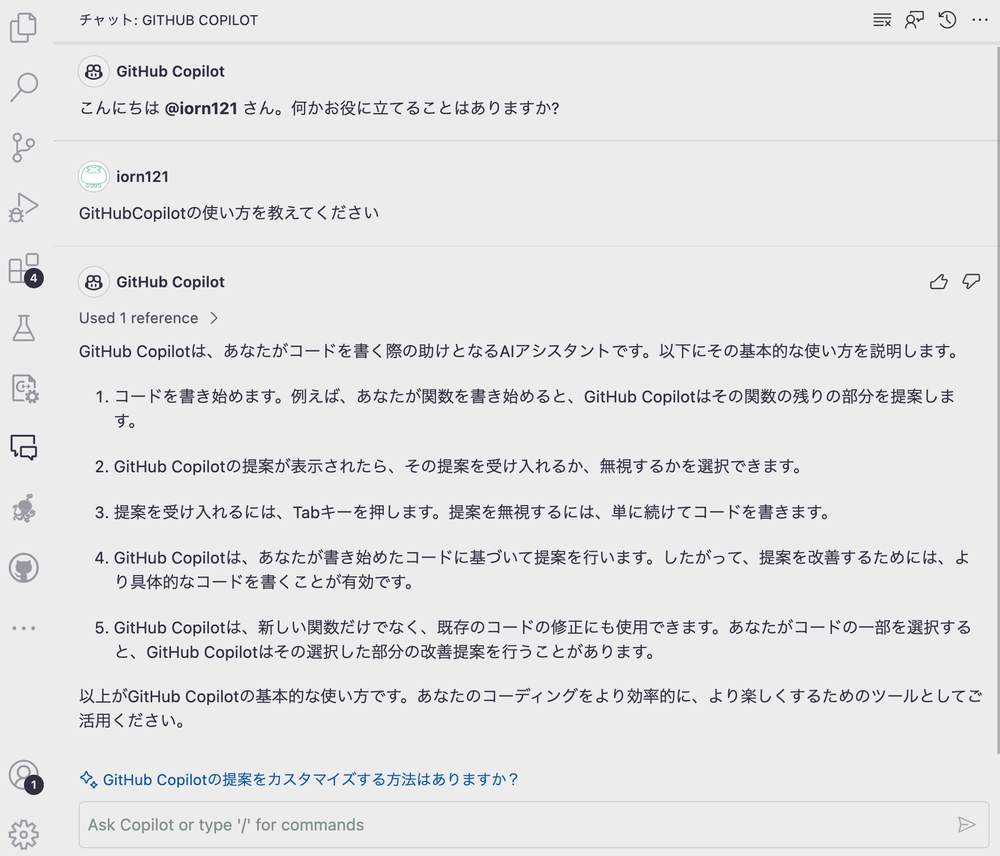
チャットで質問したり、文章を修正したり、英訳・日本語訳ができたりします。

## 2. コードの提案をしてもらう

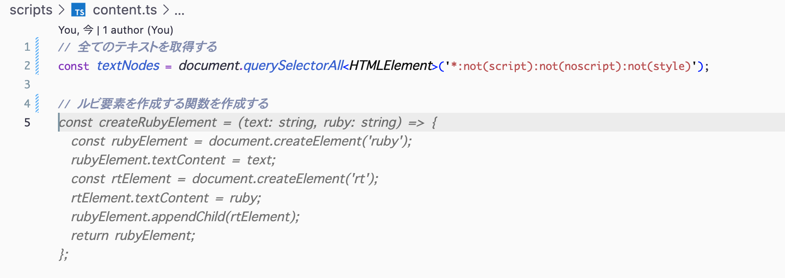

## 3. エラーの修正案を提案してもらう

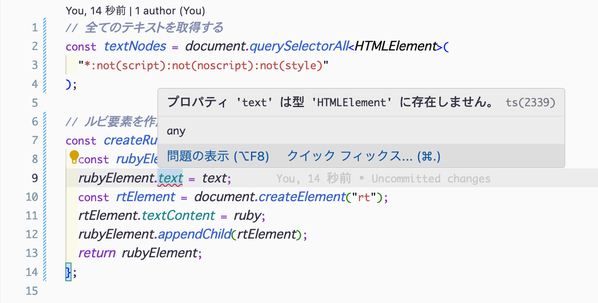
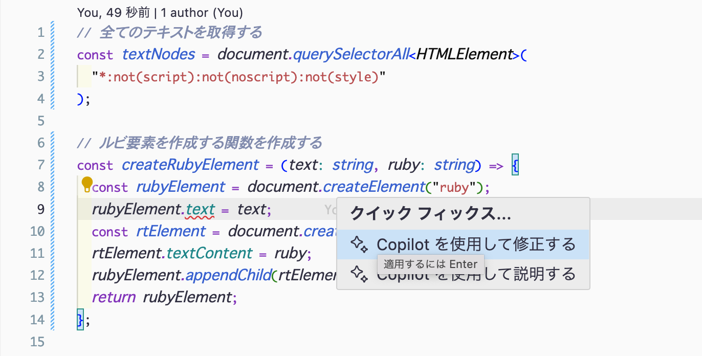
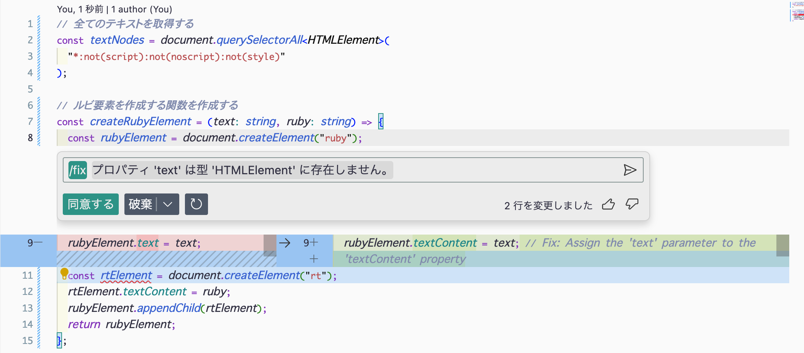
エラーにホバーすることで、修正案を提案してもらったり、エラーに関する説明を出力したりできます。

## 4. リファクタリングする

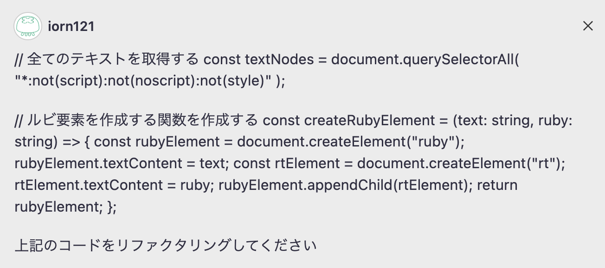
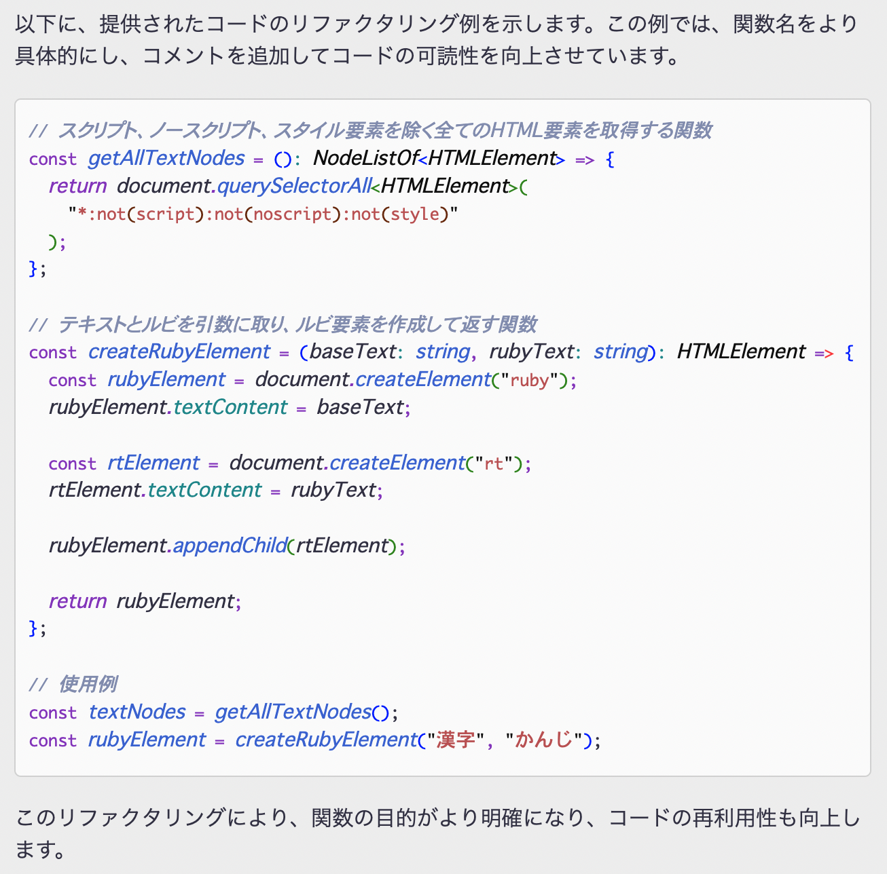
チャット機能の応用として、プログラムとリファクタリングしたいというメッセージを入れることで、リファクタリングすることが可能です。
リファクタリングの際にフォーマットルールを明記すれば、それも反映してくれます。

## 5. 単体テストを作成する

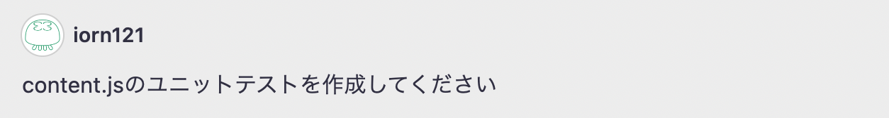
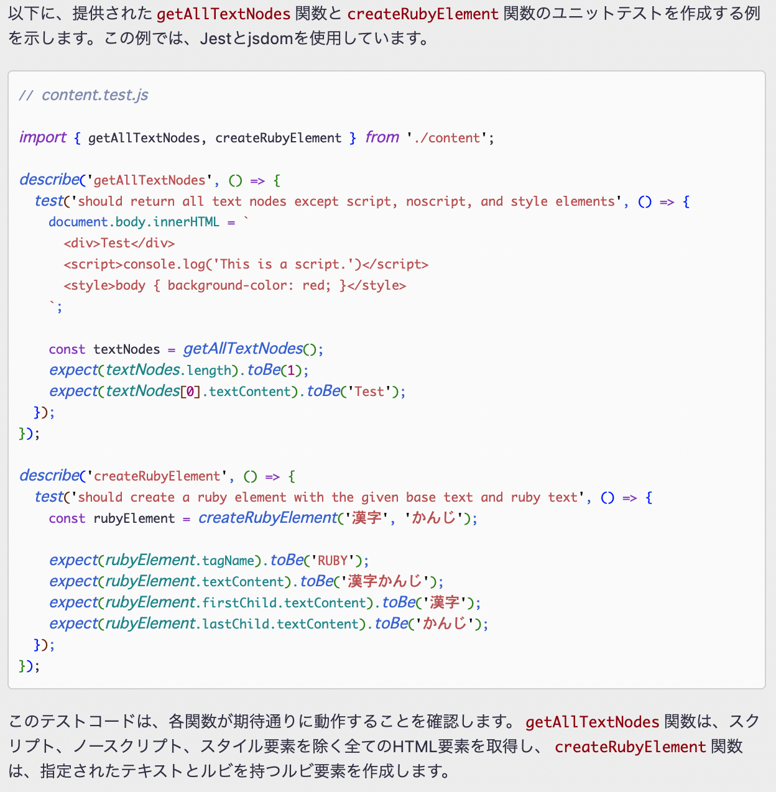
対象のファイルを指定して単体テストを作成することができます。

# 今回作るもの

上記で紹介した内容を実際に使って、モノづくりをしていきます。
何のテーマも無いと分かりにくいので、下記の要件を設けます。
※これは実際に私が作りたいと思っているツールです

- Vite と TypeScript で Chrome 拡張機能を作りたい
- 読めない IT 用語にルビを振りたい

## 環境

MacOS Monterey 12.0.1
yarn 1.22.21
Node.js 18.15.0
VSCode 1.84.2

:::note warn
VSCode の拡張機能として GitHub Copilot / GitHub Copilot Chat を導入済みであることを想定しています。
:::

## 参考にさせていただいた記事

下記の記事を参考にさせていただきました。
[TypeScript + Vite で Chrome 拡張機能を作る](https://zenn.dev/hamakou108/articles/6fec7a13d0f857)

この後は `content.ts` の内容を一通り実装を終えた状態からスタートします。

:::note warn
本記事のコンセプトにおける注意点として、「環境構築については参考にしづらい」点が挙げられます。

- 内容をチェックせずに実行するとローカル環境で破壊的な操作が行われる可能性がある
- ライブラリやフレームワークなどは時間経過でアップデートされるため情報が最新でない可能性が高い
- 必要なコマンドを提案してくれはするものの、細かな Config の設定は自分で確認することが重要なため、最適な構築が難しい

上記の点から環境構築についてはチュートリアルや記事を参考にすることをお勧めします。
:::

## config の不明な点を確認する

早速「1. チャットで質問する」ことを試してみましょう

`tsconfig.jsonの内容を説明してください。`

↓

> tsconfig.json は TypeScript のプロジェクト設定ファイルで、以下の設定が含まれています。
>
> "compilerOptions": TypeScript コンパイラの設定を指定します。
> "target": コンパイル後の JavaScript のバージョンを指定します。"ESNext"は最新の仕様にコンパイルします。
> "module": モジュールシステムを指定します。"ESNext"は最新のモジュールシステムを使用します。
> "lib": コンパイルに含めるライブラリを指定します。"ESNext"と"DOM"は最新の ECMAScript 機能と DOM API を使用できるようにします。
> "moduleResolution": モジュール解決戦略を指定します。"Node"は Node.js のモジュール解決アルゴリズムを使用します。
> "strict": 厳格な型チェックを有効にします。これにより、より安全なコードを書くことができます。
> "include": コンパイルに含めるファイルまたはディレクトリを指定します。["scripts"]は scripts ディレクトリ内のすべての TypeScript ファイルをコンパイルします。

**このように、他人が書いたプログラムを開設させて理解を深めるのはかなりおすすめの使い方です。**

## どのような処理をする必要があるか質問する

「1. チャットで質問する」を利用して、どのような手順で実装すればいいか聞いてみましょう。

`Chrome拡張機能でWebページ内の文字列を検索して、事前に用意したIT用語とその読み方の辞書を参照しながらルビを振りたいと考えています。 どのような処理を行えば良いでしょうか？`

↓

> 以下に、Chrome 拡張機能で Web ページ内の文字列を検索し、事前に用意した IT 用語とその読み方の辞書を参照しながらルビを振るための基本的な手順を示します。
> Chrome 拡張機能を作成するためのマニフェストファイル（manifest.json）を作成します。
> コンテンツスクリプトを作成します。このスクリプトは、Web ページの DOM にアクセスし、文字列の検索と置換を行います。
> IT 用語とその読み方の辞書を作成します。これは JavaScript のオブジェクトまたは JSON ファイルとして保存できます。
> コンテンツスクリプト内で、Web ページのテキストノードを走査します。
> 各テキストノードに対して、辞書内の各用語を検索します。
> 一致する用語が見つかった場合、その用語をルビタグで囲み、ルビテキストとして読み方を追加します。
> 以下に、これらの手順を実装するためのサンプルコードを示します。
>
> ```
> // manifest.json
> {
>   "manifest_version": 2,
>   "name": "IT用語ルビ振り拡張機能",
>   "version": "1.0",
>   "content_scripts": [
>    {
>      "matches": ["<all_urls>"],
>      "js": ["contentScript.js"]
>    }
>  ]
> }
>
> // contentScript.js
> const dictionary = {
>   "用語 1": "よみがな 1",
>   "用語 2": "よみがな 2",
>   // ...
> };
>
> function walk(node) {
>   if (node.nodeType === Node.TEXT_NODE) {
>     for (const term in dictionary) {
>       if (node.textContent.includes(term)) {
>         const rubyText = dictionary[term];
>         const rubyElement = `<ruby>${term}<rt>${rubyText}</rt></ruby>`;
>         node.textContent = node.textContent.replace(term, rubyElement);
>       }
>     }
>   } else {
>     for (let i = 0; i < node.childNodes.length; i++) {
>       walk(node.childNodes[i]);
>     }
>   }
> }
> walk(document.body);
> ```
>
> このコードは基本的なものであり、実際の使用にはさらなる改良が必要です。例えば、HTML タグ内のテキストを誤って置換しないようにするための処理などが必要です。

大体の流れが分かりましたね。
ただし、いくつか気になる点があります。

:::note alert
manifest_version は 2 が非推奨とされています。
[参考：Manifest V3 への移行を再開する](https://developer.chrome.com/blog/resuming-the-transition-to-mv3?hl=ja)
:::

:::note warn
node や dictionary の型が明記されておらず、暗黙的に any として解釈されます。
プロンプトの内容に TypeScript で書くことを明記しない場合などに起きやすいです。
:::

## 型に関する修正をする

まず、dictionary の型定義をしておきましょう。
コメントで`dictionaryの型定義`と入れ、「2. コードの提案をしてもらう」ことによりできました。

```

// dictionary の型定義
type Dictionary = {
[key: string]: string;
};

```

続いて、node の型を明記していなかったため、「3. エラーの修正案を提案してもらう」ことで型を追加します。
`function walk(node)`から`function walk(node: HTMLElement)`に修正できました。

## コードの修正をする

今度は、下記のようなアラートが出ました。

:::note alert
'node.textContent' は 'null' の可能性があります。ts(18047)
(property) Node.textContent: string | null
MDN Reference
:::

これも「3. エラーの修正案を提案してもらう」で解決してみます。
結果としては下記のようなコードとなり、子ノードも探索していく実装となりました。

```

function walk(node: HTMLElement | ChildNode) {
  if (node instanceof HTMLElement) {
    for (const term in dictionary) {
      if (node.textContent && node.textContent.includes(term)) {
        const rubyText = dictionary[term];
        const rubyElement = `<ruby>${term}<rt>${rubyText}</rt></ruby>`;
        node.innerHTML = node.innerHTML.replace(term, rubyElement);
      }
    }
  } else {
    for (let i = 0; i < node.childNodes.length; i++) {
      walk(node.childNodes[i] as HTMLElement);
      walk(node.childNodes[i]);
    }
  }
}

```

エラーも無くなったので、一旦こちらのプログラムで試してみましょう。

## 辞書を用意する

「2. コードの提案をしてもらう」を使って、辞書を用意します。
一旦思いついた用語で用意してみました。

```

const dictionary: Dictionary = {
Qiita: "キータ",
Vite: "ヴィート",
TypeScript: "タイプスクリプト",
JavaScript: "ジャバスクリプト",
React: "リアクト",
Vue: "ビュー",
Angular: "アングラー",
Svelte: "スベルト",
GitHub: "ギットハブ",
Copilot: "コパイロット",
VSCode: "ブイエスコード",
Python: "パイソン",
Ruby: "ルビー",
};

```

## manifest の編集

`vite.config.ts`に記載します。
下記のように Qiita や Zenn で適用できるよう設定しました。

```

import { defineConfig } from "vite";
import { crx, defineManifest } from "@crxjs/vite-plugin";

const manifest = defineManifest({
  manifest_version: 3,
  name: "Reading IT Terms",
  description: "IT 用語ルビ振り拡張機能",
  version: "1.0",
  content_scripts: [
    {
      js: ["scripts/content.ts"],
      matches: ["https://qiita.com/*", "https://zenn.dev/*"],
    },
  ],
});

export default defineConfig({
  plugins: [crx({ manifest })],
});

```

## 動作確認する

では、`yarn dev`をして、Chrome 拡張機能に追加してみます！

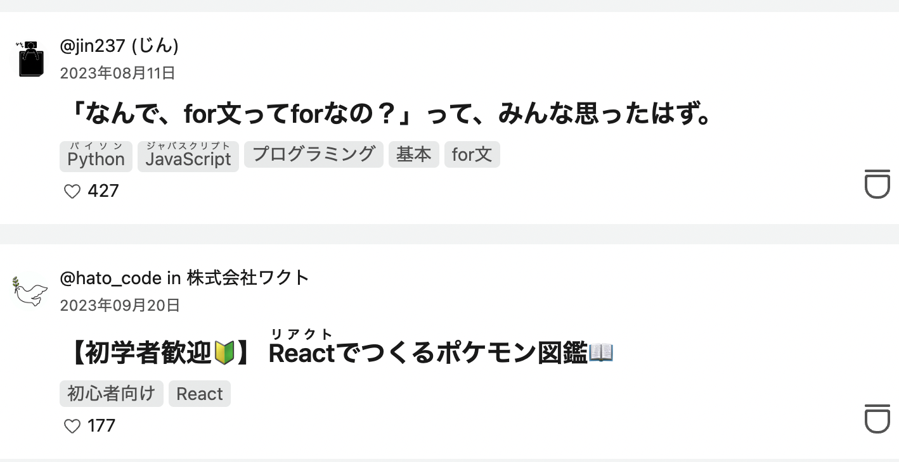

ルビがつきました！
ちゃんとタグにまで反映されていて、予想を超えるスピードで基本機能が完成しました。

しかし、記事タイトルの React にはルビがついているのにタグの React にはついていないなど、適用できていない箇所が散見されます。

:::note warn
また、今回の開発では深掘りしませんが、Qiita の右上にある操作メニューが開けないという問題が発生しました。
この不具合は button 要素で発生しているため、対処はできそうですが今回は省略します。
:::

さて、1 点目の不具合について、どういう状況かチェックするためにテストを書いてみましょう。

## テストを書いてみる

「5. 単体テストを作成する」でテストを作成してみます。
`content.tsのユニットテストを作成してください。`

↓

> まず、ユニットテストを作成するためには、テストフレームワークとアサーションライブラリが必要です。ここでは、jest と@testing-library/dom を使用します。
> これらのパッケージをインストールするには、以下のコマンドを実行します。
> `yarn add --dev jest @testing-library/dom @types/jest ts-jest`
> 次に、jest.config.js ファイルをプロジェクトのルートディレクトリに作成し、以下の内容を追加します。
>
> ```
> module.exports = {
>   preset: 'ts-jest',
>   testEnvironment: 'jsdom',
> };
> ```
>
> これで、テスト環境が整いました。次に、content.test.ts という名前の新しいファイルを作成し、以下のように walk 関数のテストを書きます。
>
> ```
> import { walk } from './content';
> import { screen } from '@testing-library/dom'
> describe('walk function', () => {
>   it('replaces text with ruby annotation', () => {
>     document.body.innerHTML = '<div>Qiita</div>';
>     walk(document.body);
>     const rubyElement = screen.getByText('キータ');
>     expect(rubyElement).toBeInTheDocument();
>   });
> });
> ```
>
> このテストは、walk 関数が指定したテキストを正しくルビ注釈に置き換えることを確認します。テストを実行するには、以下のコマンドを使用します。
> `yarn jest`
> これで、content.ts のユニットテストが作成されました。

さて、指示通りやってみます。

すると、2 つアラートが出ました。

:::note alert
'/Users/iori_watanabe/workspace/chrome-extension-read-technical-terms/scripts/content.ts' はモジュールではありません。
:::

:::note alert
プロパティ 'toBeInTheDocument' は型 'JestMatchers' に存在しません。
:::

### 1 つ目のエラーの解決

「3. エラーの修正案を提案してもらう」で説明してもらいましょう。
`/explain ファイル '/Users/iori_watanabe/workspace/chrome-extension-read-technical-terms/scripts/content.ts' はモジュールではありません。`

↓

> このエラーメッセージは、TypeScript が指定されたファイルをモジュールとして認識できないことを示しています。TypeScript では、モジュールは特定のエクスポート（関数、オブジェクト、変数など）を持つファイルとして定義されます。
>
> このエラーは通常、以下のいずれかの理由で発生します：
>
> content.ts ファイルが存在しない、または誤ったパスが指定されている。
> content.ts ファイルがモジュールとしてエクスポートを持っていない。つまり、export キーワードを使用して何もエクスポートしていない。
>
> 解決策：
>
> content.ts ファイルが正しい場所に存在することを確認してください。ファイルパスが正しいかどうかを確認します。
> content.ts ファイルに export ステートメントがあることを確認します。例えば、export function walk() {...}のような形式です。
> これらの確認を行うことで、エラーの原因を特定し、解決することができます。

2 番目の解決策を採用して、content.ts の`function walk() {...}`に export を追加しました。

### 2 つ目のエラーの解決

もう 1 個のエラーも同様に聞いてみましょう。

`/explain プロパティ 'toBeInTheDocument' は型 'JestMatchers' に存在しません。`

↓

> このエラーは、toBeInTheDocument というメソッドが Jest のマッチャに存在しないときに発生します。このメソッドは、DOM 要素がドキュメントに存在することを確認するためのもので、@testing-library/jest-dom パッケージによって提供されます。
>
> したがって、このエラーを解決するには、まず@testing-library/jest-dom をインストールする必要があります。以下のコマンドを実行してインストールします。
> `yarn add --dev @testing-library/jest-dom`
> 次に、テストファイルの先頭に以下のインポートステートメントを追加します。
> `import '@testing-library/jest-dom'`
> これにより、toBeInTheDocument というメソッドが Jest のマッチャに追加され、エラーが解消されます。

言われた通り実装してみました。

ここからもエラーが生じましたが同様に質問して下記 2 点のように対処

1. `import "@testing-library/jest-dom/extend-expect";`の削除

2. `yarn add --dev jest-environment-jsdom`で"jest-environment-jsdom"をインストール

ここまで修正することで、ようやくテストが通りました！
問題なく動作していることが確認できました。

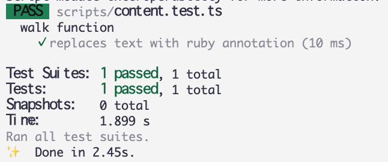

:::note warn
div 要素以外のテストも書いて実行してみても問題なかったため、先ほどの問題の原因についてはもう少しブラウザの挙動を確認してみる必要がありそうです。
正規表現を使っていないため、正確に文字を検出できずに漏れている可能性が高いです。
これも本記事の趣旨とは反するので、一旦深掘りはしません。
:::

## さらなる改良

### 難読用語の追加

自分がこれまで読み間違えた IT 用語を片っ端から追加していきます。
今回は辞書の要素回数分だけ実行するため無限に追加するわけにもいきません。

結果こんな感じになりました。
~~読み方は諸説あるかと思うので、ご指摘あればお願いします~~

```
const dictionary: Dictionary = {
  qiita: "キータ",
  vite: "ヴィート",
  vue: "ビュー",
  angular: "アングラー",
  svelte: "スベルト",
  python: "パイソン",
  rust: "ラスト",
  kotlin: "コトリン",
  gif: "ジフ",
  exe: "エグゼ",
  ieee: "アイエトリプルイー",
  kubernetes: "クーバネティス",
  awk: "オーク",
  lambda: "ラムダ",
  nginx: "エンジンエックス",
  postgresql: "ポストグレスキューエル",
  jupyter: "ジュパイター",
  laravel: "ララベル",
  yarn: "ヤーン",
  apach: "アパッチ",
  cache: "キャッシュ",
  arch: "アーチ",
  auth: "オース",
  bios: "バイオス",
  zsh: "ジーシェル",
  cidr: "サイダー",
  column: "カラム",
  csrf: "シーサーフ",
  ddos: "ディードス",
};
```

### 大文字小文字の区別をしない

大文字と小文字を区別していないためにルビが振られていない用語が多々ありました。
特に 1 文字目を大文字にするかどうかは個人差もあり、体感よく見かけます。

「2. コードの提案をしてもらう」で 修正していきましょう。

`これを「HTMLの元のテキストが大文字小文字関係なくヒットする」、「ルビを振るときに元の文字列は保持する」ように改良してください`

↓

> 大文字小文字を区別せずにマッチングを行い、ルビを振るときに元の文字列を保持するためには、以下のようにコードを改良します。
>
> ```
> export function walk(node: HTMLElement | ChildNode) {
>   if (node instanceof HTMLElement) {
>     for (const term in dictionary) {
>       const regex = new RegExp(`(${term})`, 'gi');
>       if (node.textContent && regex.test(node.textContent)) {
>         const rubyText = dictionary[term];
>         node.innerHTML = node.innerHTML.replace(regex, (match) => `<ruby>${match}<rt>${rubyText}</rt></ruby>`);
>       }
>     }
>   } else {
>     for (let i = 0; i < node.childNodes.length; i++) {
>       walk(node.childNodes[i] as HTMLElement);
>     }
>   }
> }
>
> walk(document.body);
> ```
>
> このコードでは、RegExp オブジェクトを使用して大文字小文字を区別せずにマッチングを行います。また、replace メソッドの第二引数に関数を使用して、マッチした文字列（match）をそのままルビ注釈の中に保持します。

### リファクタリングをする

「4. リファクタリングする」ことで、可読性をあげましょう。

`content.tsのコードをリファクタリングしてください。 各処理の内容についてのコメントも追加してください。`

↓

> 以下に、リファクタリングしたコードを示します。各処理の内容についてのコメントも追加しました。
>
> ```
> // ノードを走査し、テキストをルビ注釈に置き換える関数
> export function walk(node: HTMLElement | ChildNode) {
>   // ノードがHTMLElementのインスタンスである場合
>   if (node instanceof HTMLElement) {
>     // 辞書の各項目について
>     for (const term in dictionary) {
>       // ノードのテキスト内容が存在し、そのテキストが辞書の項目を含む場合（大文字小文字を区別しない）
>       if (
>         node.textContent &&
>         node.textContent.toLowerCase().includes(term.toLowerCase())
>       ) {
>         // ルビ注釈のテキストを取得
>         const rubyText = dictionary[term];
>         // ルビ注釈のHTML要素を作成
>         const rubyElement = `<ruby>${term}<rt>${rubyText}</rt></ruby>`;
>         // ノードのHTML内容を、ルビ注釈のHTML要素で置き換え
>         node.innerHTML = node.innerHTML.replace(term, rubyElement);
>       }
>     }
>   } else {
>     // ノードがHTMLElementのインスタンスでない場合、その子ノードすべてについて再帰的にこの関数を実行
>     for (let i = 0; i < node.childNodes.length; i++) {
>       walk(node.childNodes[i] as HTMLElement);
>     }
>   }
> }
>
> // ドキュメントのbody要素を走査
> walk(document.body);
> ```
>
> このリファクタリングでは、主にコメントを追加しました。また、walk(node.childNodes[i]);の行が重複していたため、1 つを削除しました。

### テストを作り直す

ここまで変更した内容はテストも通りました。
ただ、新たな処理を追加したので、テストを書き直しておきましょう。

:::note warn
本来はテストを書き換えるのではなく追加する方が良いですが、ここでは分かりやすくするためプロンプトで細かく条件を指定して一から作り直しました。
:::

`content.tsのwalk関数のユニットテストを作成してください。 「ルビを振ることができているか」「大文字を含む文字列がルビを追加しても大文字のままかどうか」「あてはまる文字列がないときはそのままかどうか」について確認できるようにしてください。`

↓

> ```
> import { walk } from "./content";
>
> describe("walk", () => {
>   it("should replace text with ruby annotation", () => {
>     // JSDOMを使用してテスト用のDOMを作成
>     document.body.innerHTML = "<div>qiita</div>";
>
>     // walk関数を実行
>     walk(document.body);
>
>     // 結果を検証
>     expect(document.body.innerHTML).toBe(
>       "<div><ruby>qiita<rt>キータ</rt></ruby></div>"
>     );
>   });
>
>   it("should preserve case when adding ruby annotation", () => {
>     // JSDOMを使用してテスト用のDOMを作成
>     document.body.innerHTML = "<div>Qiita</div>";
>
>     // walk関数を実行
>     walk(document.body);
>
>     // 結果を検証
>     expect(document.body.innerHTML).toBe(
>       "<div><ruby>Qiita<rt>キータ</rt></ruby></div>"
>     );
>   });
>
>   it("should not replace text if not in dictionary", () => {
>     // JSDOMを使用してテスト用のDOMを作成
>     document.body.innerHTML = "<div>notInDictionary</div>";
>
>     // walk関数を実行
>     walk(document.body);
>
>     // 結果を検証
>     expect(document.body.innerHTML).toBe("<div>notInDictionary</div>");
>   });
> });
> ```
>
> このコードでは、walk 関数が DOM ツリーを再帰的に探索し、テクニカルタームをルビ注釈付きに置換します。大文字小文字を区別せずにマッチングを行い、元のテキストを保持します。

これでテストをして問題なく通りました。
長かったですが、これでようやく機能を一通り試して Chrome 拡張機能を作れました！

参考記事に適用してみたところ、無事反映できていることが確認できました。

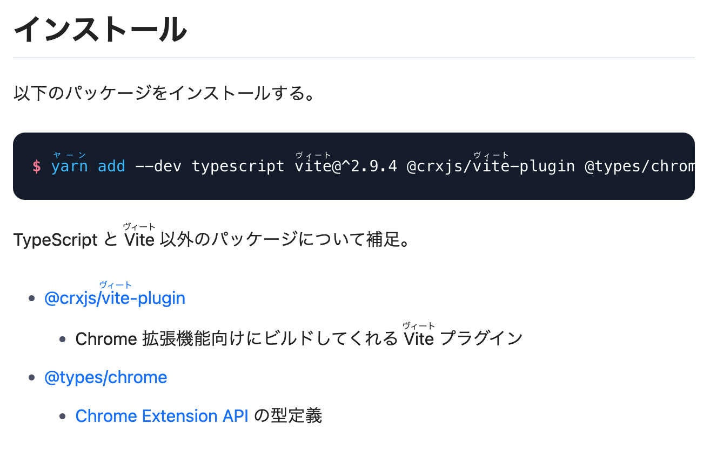

# おわりに

本記事の執筆と並行して制作したにも関わらず、3, 4 時間程度でここまで出来ました。
このペースで爆速開発をしていけば、きっと積制作も解消できることでしょう。

また、今回はほぼコードを書いていません。
それでも思った通りの機能が作れるというのはとてもロマンがあります。

ただし、今回は上手くいった点を重点的に取り上げたため、いくつか問題点を素通りしています。

最後にその注意点についてまとめておきましょう。

- **環境構築は書籍やチュートリアルを参照して、バージョンやライブラリに気をつけて開発しよう**
  下手に古い情報やライブラリの依存関係に引っかかって沼ってしまうと楽をするどころか余計な苦労を強いられることになります。
  <br>
- **プロンプトはきちんと要件を定めてから考えよう**
  お気づきの方もいるかもしれませんが、今回の制作でも終盤は細かく条件をしています。大雑把に書いてもそれっぽいものを出力してしまうため、求める処理が複雑になるほどエラーを吐く確率が上がります。
  <br>
- **結局は知識がないと進め方が分からなくなることもある**
  今回は manifest の設定やエラーの解決もスムーズに出来ました。しかし、それなりの規模のプロダクトを作ろうと思うと、config の細かな設定やワークフローはもちろん、エラーも複雑になっていきます。

皆さんのモノづくりにこの記事が少しても役立てば幸いです。
